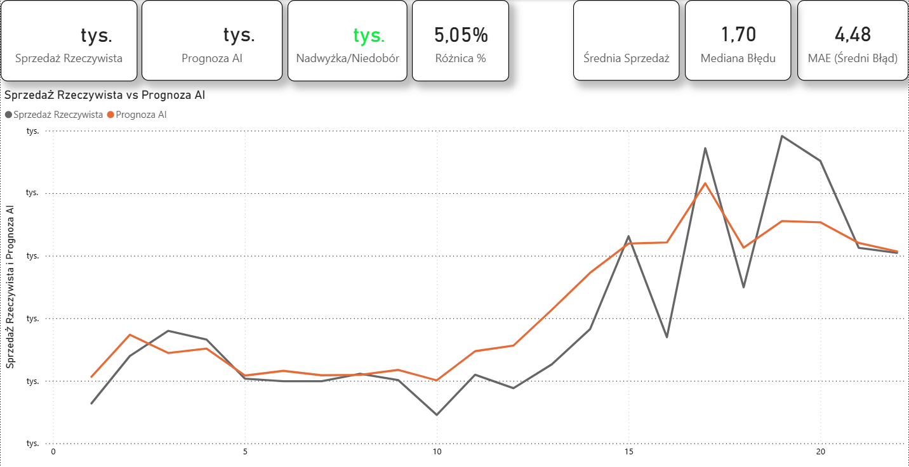
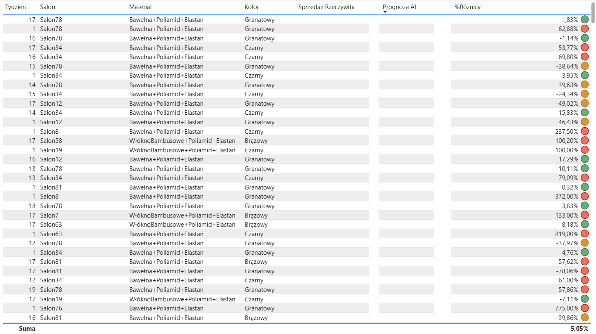
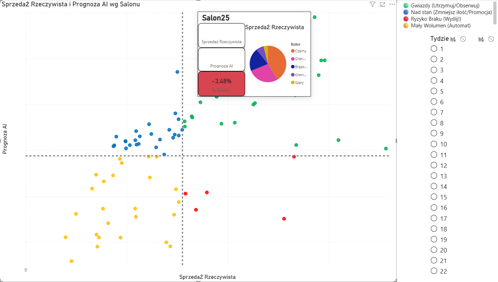

# 🚀 AI-Driven Retail Replenishment System


> **Engineering Thesis Project:** An end-to-end automated replenishment system combining Machine Learning forecasting with business logic (Push/Pull strategies) to optimize inventory levels in a fashion retail chain.

---

## 🎯 Executive Summary
Traditional retail replenishment often relies on static averages or manual intuition, leading to **Stockouts** (lost sales) or **Overstock** (frozen capital). 

This project solves this by implementing a **Hybrid AI approach**:
1.  **Forecasting:** Uses recursive XGBoost models to predict demand at the SKU/Store level.
2.  **Allocation (Push):** Automatically suggests initial stock distribution for new collections.
3.  **Replenishment (Pull):** Identifies inter-store transfer opportunities based on local sales potential.
4.  **Decision Support:** A "Human-in-the-Loop" Power BI dashboard that translates ML predictions into actionable logic (Buy/Move/Discount).

---

## 📊 Business Process & Logic (BPMN)
The system operates on a weekly cycle, integrating automated data processing with human planner verification.


*Figure 1: High-level overview of the weekly replenishment process (AI + Human Decision).*

---

## 🖥️ The "Command Center" (Power BI Dashboard)
The heart of the system is the interactive dashboard designed for Logistics Planners. It moves beyond simple reporting to **active anomaly detection**.

### 1. Strategic View: The Decision Matrix
Segments stores into 4 dynamic quadrants based on **Sales Performance vs. AI Forecast**.


*(Note: Data masked for confidentiality)*

* 🔴 **Stockout Risk (High Sales / Low Forecast):** Action -> **PUSH.** Immediate replenishment needed.
* 🔵 **Overstock Risk (Low Sales / High Forecast):** Action -> **PULL.** Suggest inter-store transfer.
* 🟢 **Star Performers:** Action -> **Monitor.** Maintain availability.

---

### 2. Operational View: SKU-Level Action Report
While the scatter plot provides a helicopter view, this report allows planners to execute specific moves.



* **Traffic Light System:**
    * 🔴 **Red:** Critical Forecast Bias (>50% error). Requires manual review.
    * 🟡 **Yellow:** Moderate deviation.
    * 🟢 **Green:** Accurate forecast within acceptable margin.
* **Logic:** Prioritizes products with the highest financial impact (Volume * Price).

---

### 3. Tactical View: Store Drill-Down
**UX Highlight:** The report features **Custom Tooltips** allowing drill-through analysis for each specific store without leaving the main view.



---

## ⚙️ Technical Architecture

### 1. Database & SQL Logic (The Engine)
Advanced SQL techniques were used to prepare robust datasets for the ML model:
* **Cyclic Time Encoding:** Instead of standard months (1-12), `SIN` and `COS` transformations were applied to preserve the cyclical nature of fashion seasonality.
* **Window Functions:** Complex `OVER (PARTITION BY ...)` logic to calculate lags, moving averages, and cumulative totals directly in the database for performance.
* **Materialized Views:** Used for query optimization to serve data to the Python loader instantly.

### 2. Python & Machine Learning (The Brain)
* **Recursive Forecasting:** The model predicts one week ahead, uses that prediction as input for the next week, allowing for multi-step future visibility.
* **Feature Engineering:** Extensive mapping of categorical variables (Color, Fabric, Silhouette) to numerical features.
* **Data Quality (DQ):** *(Post-Thesis Enhancement)* Added a robust ETL loader with logging and validation checks to prevent data corruption (e.g., negative prices, null critical keys) before training.

### 3. Power BI (The Interface)
* **DAX Measures:** Implemented dynamic segmentation logic (`SWITCH`) to color-code quadrants based on real-time filter selection.
* **Dynamic Limits:** The "average" lines on charts adjust automatically to the selected time window.

---

## 📂 Project Structure

```text
├── assets/                            # Images for README & Documentation
│   ├── 00_process_flow_bpmn.png
│   ├── 01_strategic_overview_dashboard.png
│   ├── 02_sku_level_action_report.png
│   └── 03_store_drilldown_tooltip.png
├── docs/                              # Technical Diagrams (Architecture, Pipelines)
│   ├── etl_and_training_pipeline_flow.png
│   └── system_architecture_overview.png
├── sql_logic/                         # SQL Transformation & Feature Eng.
│   ├── 01_cyclic_time_encoding.sql
│   ├── 02_complex_window_functions.sql
│   └── 04_performance_optimization.sql
├── python_model/                      # ML Training & ETL Scripts
│   ├── 01_model_training_xgboost.py
│   ├── 03_forecast_engine_hybrid.py
│   └── 04_etl_database_loader.py
├── requirements.txt                   # Dependencies
└── README.md

## 🚀 How to Run

1.  **Install Dependencies:**
    ```bash
    pip install -r requirements.txt
    ```
2.  **Database Setup:**
    Execute SQL scripts from `sql_logic/` in your PostgreSQL instance to prepare the schema and views.
3.  **Run Pipeline:**
    ```bash
    python python_model/04_etl_database_loader.py
    python python_model/01_model_training_xgboost.py
    ```

---

### 👤 Author
**Wojciech Pietrzak**
*Aspiring BI Developer / Data Analyst*
* *Combining technical skills (SQL/Python) with strong business acumen (Supply Chain/Retail).*
* 📧 [wojciech.pietrzak02@gmail.com](mailto:wojciech.pietrzak02@gmail.com)